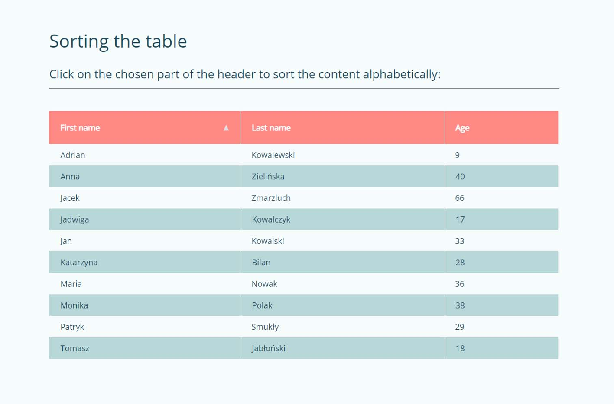

# JavaScript exercise 3 - Sorting the table
> My third practical project while learning JavaScript. [Click here to preview](https://karbudzik.github.io/JavaScript-exercise-3-sorting-the-table/) 
> Script based on the exercise from JavaScript Basic Course on eduweb.pl.

## Screenshots

## Technologies
* HTML5
* plain CSS / no frameworks
* plain JavaScript / no frameworks

## Credits
* [eduweb.pl JavaScript Basic Course](https://eduweb.pl/kursy/javascript/javascript-podstawy.html)